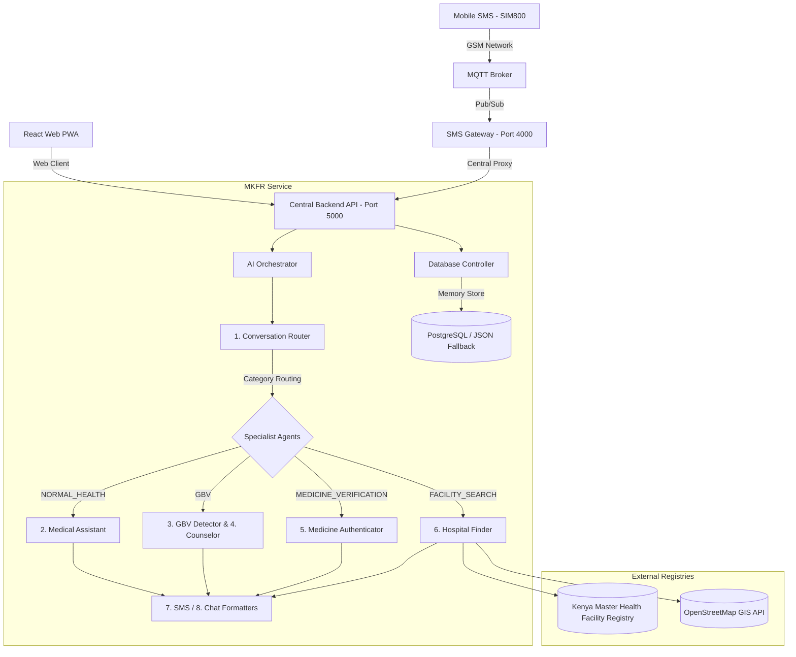

# AFYAROOT: AI-Powered Rural Health Companion for Kenya

AFYAROOT is an offline-first, multi-channel **AI Health Operating System** designed to support patients in rural and low-connectivity environments. Unlike generic chatbots, AFYAROOT links SMS, Web PWAs, and local facility registries into a unified health journey that remembers patient history, evaluates safety concerns like Gender-Based Violence (GBV), verifies medicines, and routes requests to specialized medical AI agents.

---

## 🏗️ System Architecture



---

## 🚀 Getting Started

### 📋 Prerequisites
* **Node.js** (v18 or higher recommended)
* **npm** (v9 or higher)
* **PostgreSQL** (Optional; backend falls back gracefully to a file-persisted JSON database (`db.json`) if unavailable).

---

### 🔧 Installation & Setup

1. **Clone the repository and install dependencies in all three modules:**
   ```bash
   # Install backend dependencies
   cd MKFR && npm install
   
   # Install SMS gateway dependencies
   cd ../SMS && npm install
   
   # Install React PWA dependencies
   cd ../afyaroot-health-assist && npm install
   ```

2. **Configure Environment Variables:**
   * Create [MKFR/.env](file:///home/activator/Projects/MMUST-EMPORIUM-HACKATHON/MKFR/.env):
     ```env
     PORT=5000
     GEMINI_API_KEY=your_gemini_api_key_here
     VERTEX_API_KEY=your_vertex_api_key_here
     GOOGLE_CLOUD_PROJECT=gen-lang-client-0852400804
     GOOGLE_CLOUD_LOCATION=us-central1
     # DB_HOST=localhost (Uncomment to use PostgreSQL)
     ```
   * Create [SMS/.env](file:///home/activator/Projects/MMUST-EMPORIUM-HACKATHON/SMS/.env):
     ```env
     PORT=4000
     MQTT_URL=mqtt://64.23.145.236:1883
     DEVICE_ID=sim800-node-01
     BACKEND_API_URL=http://localhost:5000
     ```
   * Create [afyaroot-health-assist/.env.local](file:///home/activator/Projects/MMUST-EMPORIUM-HACKATHON/afyaroot-health-assist/.env.local):
     ```env
     VITE_BACKEND_URL=http://localhost:5000
     VITE_SUPABASE_URL=your_supabase_url
     VITE_SUPABASE_ANON_KEY=your_supabase_key
     ```

---

### 🏃 Running the Servers

Start the servers in separate terminals:

```bash
# 1. Start the main API backend
cd MKFR && node server.js

# 2. Start the SMS Gateway Bridge
cd SMS && node src/index.js

# 3. Start the React PWA Client
cd afyaroot-health-assist && npm run dev
```

* **React PWA Portal:** [http://localhost:8080](http://localhost:8080)
* **Central API Backend:** [http://localhost:5000](http://localhost:5000)
* **SMS Bridge Gateway:** [http://localhost:4000](http://localhost:4000)

---

## 🔌 API Endpoint Documentation

### 1. Unified Conversations API

#### `POST /api/conversations/message`
Processes an incoming text message, routes it through the specialized Multi-Agent AI system, registers it in database memory, and formats the output based on the input channel.

* **Request Headers:** `Content-Type: application/json`
* **Request Body:**
  ```json
  {
    "text": "I feel sick and have had joint pain for two days",
    "phoneNumber": "+254712345678",
    "webUserId": "WEB-USER-UUID",
    "channel": "WEB",
    "userLat": 0.2828,
    "userLng": 34.7519
  }
  ```
  *(Note: Send either `phoneNumber` for SMS/WhatsApp channels, or `webUserId` for Web Client chats).*
* **Response Body (Success):**
  ```json
  {
    "success": true,
    "data": {
      "conversationId": "CONV-853773",
      "message": {
        "id": "MSG-877381",
        "sender": "agent",
        "message": "Jambo! I understand you are feeling sick. To help me understand better, do you have a fever or cough?",
        "channel": "WEB",
        "classification": {
          "category": "NORMAL_HEALTH",
          "urgency": "LOW",
          "intent": "reporting_symptoms",
          "language_detected": "English"
        },
        "aiModel": "gemini-2.5-flash-lite + web-chat-assistant",
        "status": "sent"
      }
    }
  }
  ```

---

#### `GET /api/conversations/lookup`
Retrieves conversation history and metadata mapped to a specific user using their identifier.

* **Query Parameters:**
  * `webUserId` (string, optional)
  * `phoneNumber` (string, optional)
* **Response Body:**
  ```json
  {
    "success": true,
    "conversation": {
      "id": "CONV-853773",
      "phoneNumber": null,
      "webUserId": "WEB-USER-UUID",
      "channel": "WEB"
    },
    "messages": [
      {
        "id": "MSG-100234",
        "sender": "user",
        "message": "I feel sick",
        "timestamp": "2026-07-11T07:09:40.000Z"
      },
      {
        "id": "MSG-877381",
        "sender": "agent",
        "message": "Jambo! To help me understand, do you have fever?",
        "timestamp": "2026-07-11T07:09:43.000Z"
      }
    ]
  }
  ```

---

#### `GET /api/conversations/classified`
Retrieves messages flagged under a specific category, enabling oversight logs (e.g. for reviewing GBV alerts).

* **Query Parameters:**
  * `category` (string, required: e.g. `GBV`, `EMERGENCY`)
* **Response Body:**
  ```json
  {
    "success": true,
    "data": [
      {
        "id": "MSG-688799",
        "conversationId": "CONV-853773",
        "sender": "user",
        "message": "my husband hit me and I'm scared to go home",
        "channel": "WEB",
        "classification": {
          "category": "GBV",
          "urgency": "CRITICAL",
          "reason": "Signs of domestic violence"
        },
        "timestamp": "2026-07-11T07:09:43.000Z"
      }
    ]
  }
  ```

---

#### `GET /api/conversations/:id/history`
Exposes the chronological message array of a specific conversation thread.

* **Request Parameters:**
  * `id` (string, required): The target conversation ID.
* **Response Body:**
  ```json
  {
    "success": true,
    "data": [
      {
        "id": "MSG-877381",
        "sender": "agent",
        "message": "Jambo! To help me understand, do you have fever?",
        "timestamp": "2026-07-11T07:09:43.000Z"
      }
    ]
  }
  ```

---

### 2. KMHFR GIS Registry & Triage API

#### `GET /api/facilities/nearby`
Queries the database for Kenya medical facilities near a user's location, sorted by distance.

* **Query Parameters:**
  * `lat` (float, required): User latitude.
  * `lng` (float, required): User longitude.
  * `radius` (float, optional, default: 20): Search radius in kilometers.
* **Response Body:**
  ```json
  {
    "success": true,
    "count": 1,
    "data": [
      {
        "code": "15982",
        "name": "Kakamega County General Referral Hospital",
        "facility_type": "Level 5 County Referral",
        "latitude": "0.2828",
        "longitude": "34.7519",
        "services": ["Outpatient Services", "Emergency Care", "Maternity"],
        "county": "Kakamega"
      }
    ]
  }
  ```

---

#### `GET /api/route`
Scores facilities based on services available, KEPH Levels, distance, and current capacity/wait emergencies.

* **Query Parameters:**
  * `userLat` (float, required)
  * `userLng` (float, required)
  * `requiredServices` (array of strings, optional)
* **Response Body:**
  ```json
  [
    {
      "code": "15982",
      "name": "Kakamega County General Referral Hospital",
      "distance_km": 1.8,
      "score": 92.5,
      "keph_level": "Level 5"
    }
  ]
  ```

---

## 🎯 Uniqueness & Key Features

* **Multi-Agent Collaboration:** A central Router AI automatically handles classification, dynamically forwarding inputs to specialized clinical educators, GBV counselors, medicine verifiers, or facility allocators.
* **GBV Early Detection Safety Flow:** Switches instantly to a secure counselor layout displaying the **Kenya National Helpline (1195)** if domestic violence indicators are flagged.
* **Dynamic Companion timeline:** The React PWA dashboard constructs a vertical health timeline mapping user query history and updates metrics (water, sleep, and BP) locally under the user's patient ID profile.
* **Offline-Resilient Architecture:** When deployed on production servers, calls can route locally through **Ollama** using `BioMistral-7B-Instruct` and query cached KMHFR registries, allowing uninterrupted coverage in rural villages without internet connection.